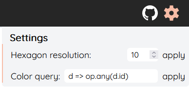

# Hierarchical Image Explorer (HIE)

The goal of this project was to develop a Level of Detail visualization for large-scale image datasets that allows interactive exploration of the data. It is part of the specialization subject Computer Graphics in the 5th and 6th semester for computer science and media students at Ulm University.


---

## Frontend development
The project with an example dataset loaded can be found [here](http://nemesis.informatik.uni-ulm.de/frontend/main/).

### Starting up
* Adjust `SERVER_ADDRESS` in `src/config.ts` to the backend IP.
* Build static site with `yarn build` (or run dev-mode with `yarn dev` for live preview)

### Home page
After building the website, you are directed to the home page of the project. To start exploring data, click "Let's explore some data!"

### Exploring data
The image explorer offers a view of clusters of images in a certain alignment on a 2D plane. To explore the data, zooming and panning is possible. Zooming in will reveal continuously smaller clusters until only one image is visible. Every cluster can be selected to reveal additional information.

#### Selecting clusters
Selecting clusters (and single images) can be done in two ways:
1. Selecting them one by one with a click
2. Using the lasso tool (`ALT` or button on top)

We support selecting two none overlapping sets of clusters and offer various ways to compare them.

To switch between selecting group A and B use `x` or the button next to the lasso tool.
To unselect all clusters at once, use `ESC`.

#### Filters
The dataset can be filtered using a simple UI and more complex queries. To add a filter, open the right panel and click "add filter". If multiple filters are present, they are processed in order. Filters can be concatenated in with `OR` and `AND`. These operations apply to all the previous filters in the list.
Under each filter, the corresponding [arquero](https://uwdata.github.io/arquero/api/) query is displayed. These can be directly edited to achieve more complex filter operations.


 
#### Minimap
In the bottom right of the view is a minimap. The minimap always displays the clusters of the unfiltered dataset. 

#### Graphs and cluster info
Once one or multiple clusters are selected, the left sidebar opens, and the user is provided with additional information on the selected clusters:

- the representative image of the selections
- the number of images in each cluster as a pie chart

Furthermore, if the dataset provides adequate columns such as labels, outlier score or probability, the user can select the columns in the dropdown menu to be displayed in a graph. Subsequently, discrete values are displayed as a mirrored bar chart (if two selections are chosen) or as a pie chart (if only one selection is chosen). Continuous  values are displayed as a box plot or histogram.


#### Settings

Settings can be changed in the settings menu (gearwheel) in the upper right corner. You can alternate the following:

1. Resolution
    - determines how many hexagons will be layed over the data and will be displayed on screen (higher resolution -> more hexagons, vice versa)
    - effectively changes the number of columns displayed (standard setting is 10)
    - *note: since hexagons have to be shifted by half a hexagon every row to get a perfect fit, only columns with hexagons having the same height are counted as one column and too high values (>20) may lead to performance issues*

2. Color query
    * This property determines the hexagon outline color. It can be modified with an [arquero](https://uwdata.github.io/arquero/api/) expression. If the query results in a number, a continuous color scale is applied. One can switch between different scales. For other values, the categorical [tableau-10](https://www.tableau.com/about/blog/2016/7/colors-upgrade-tableau-10-56782) palette is used. If needed, the colors may repeat.



---

## Backend development
This section covers the interaction with the backend of the image explorer. You will learn how to get the project started on your local machine, as well as how to integrate new datasets. The backend provides the frontend with the image data as an arrow table as well as the images itself. Furthermore, it handles everything from preparing new datasets, to aggregating and loading in the datasets to be explored in the frontend.

### Getting started

1. Clone the repository using your method of choice
2. run `yarn` to initialize the project and install all necessary packages
3. run `yarn build` to compile and build the project
4. run `yarn start -c <config_path> -p <port(default = 25679)>` to start the backend server (navigate to [localhost:5000](http://localhost:5000))

#### Further commands

- `yarn format`: runs the Prettier code formatter
- `yarn lint`: runs the eslint linter, returning all linting problems
- `yarn lint:fix`: runs the eslint linter and automatically fixes all linting problems

### Technology stack
- Code formatter: [prettier](https://prettier.io/)
- Linter: [eslint](https://eslint.org/)
- Web-framework: [svelte](https://svelte.dev/)

### Preparing datasets

A dataset needs a descriptive `.arrow` file this can be obtained in two ways:

#### Preparing predefined datasets (mnist, flowers, cifar-10)

* Can be automatically downloaded with the `data_provider.py` script
* `data_provider.py` can be easily expanded to support other image datasets where the folder of an image determines its class

#### Preparing custom datasets

* The expected Arrow IPC file requires the following columns:
  * `image_id` a unique identifier
  * `file_path` relative path to image file
  * [optional] more columns containing data (e.g. `label`, `classification`, `probability`, ...)
  * [optional] representation of the image (e.g. `activations`, `feature_vector`, ...)

#### Generating dimensionality reduction

For dimensionality reduction the backend expects an arrow IPC table containing: (`id`, `x`, `y`). These can be automatically generated with `data_processing.py`. The scripts supports 3 image representations (`-enc`):

* `pixels` raw pixel data
* `vgg-16` feature vector generated from a pre-trained VGG-16 model
* `arrow.<column>` take custom data from the dataset description table

#### Loading data in the backend

The backend takes in a configuration file (`-c`) this contains 3 properties:

* `swg` path to dataset arrow IPC table
* `points2d` path to dimensionality reduction arrow IPC table
* `imgDataRoot` path to the relative root of image paths

#### Example

We have an exported table `raw_data.arrow` containing the columns: (`image_id`, `file_path`, `label`, `prediction`,  `probability`, `activations`). `activations` contains the representation of the image we want to use going forward. We put the table in `backend/data/example` and the images in `backend/data/examples/images`.

One row might look like this:

| image_id | file_path                    | label  | prediction | probability | activations         |
| -------- | ---------------------------- | ------ | ---------- | ----------- | ------------------- |
| '01'     | 'data/example/images/01.jpg' | 'bird' | 'plane'    | 0.2543      | [0.2342,...,0.3243] |

* Run dimensionality reduction: `python data_processing.py data/example -enc arrow.activations -dim umap ` this generates the file `data/example/raw_data_umap.arrow`
* Now we write a config for the server:

```js
// backend/configurations/config_example.json
{
    "swg": "data/example/raw_data.arrow",
    "points2d": "data/example/raw_data_umap.arrow",
    "imgDataRoot": "../"
}
```

Now start the backend server with `yarn start -c configurations/config_example.json`
The frontend needs no further adjustment to different datasets.

---

Enjoy exploring data!

Cheers, Daniel & Niklas<sup>2</sup>